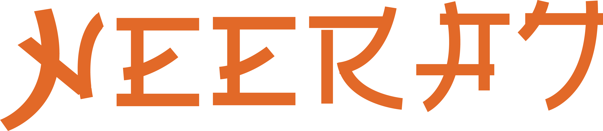

<!--  -->

A full-stack web developer adept at building responsive web application. Loves the creative challenge of designing and implementing user interfaces. My goal is to help you build the best possible product from conception all the way through implementation.

## 🌐 Socials:
    

# 💻 Tech Stack:
                        	    
# 📊 GitHub Stats:
 
 

## 🏆 GitHub Trophies

### ✍️ Random Dev Quote

  

