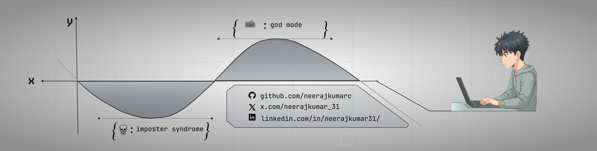

<!--  -->

---
# Hi, I'm 
<picture  >
  <source media="(prefers-color-scheme: dark)" srcset="dark.png">
  <source media="(prefers-color-scheme: light)" srcset="light.png">
  
</picture>
 
console.log('Hello, World!');

## Current Projects

- **[toolcase](https://github.com/neerajkumarc/toolcase)** - a macOS menu bar app that holds a bunch of small tools
- **[duellify](https://github.com/neerajkumarc/duellify)** - a live multiplayer game, duel with any one on any topic
- **[html-studio](https://github.com/falsegenius1/html-studio)** - a simple html editor
- **[json-viewer](https://github.com/falsegenius1/json-viewer)** - a browser extension to quickly view formatted json
- **[hbdcake](https://github.com/falsegenius1/hbdcake)** - a virtual birthday cake 🎂 that's ready for you to blow out the candles 🕯️
- **[5-minutes-death-journal](https://github.com/falsegenius1/5-minutes-death-journal)** - A simple journal that take only 5 minutes
- **[ai-email-classifier](https://github.com/falsegenius1/ai-email-classifier)** - a simple implementation to classify emails using AI
- **[endlesschainstory](https://github.com/falsegenius1/endlesschainstory)** -  a collaborative storytelling adventure where every contribution adds to an endless chain story
- **[mift](https://github.com/falsegenius1/mift)** - a minimal finance tracker app
- **[news-api](https://github.com/falsegenius1/news-api)** - a Simple News API
